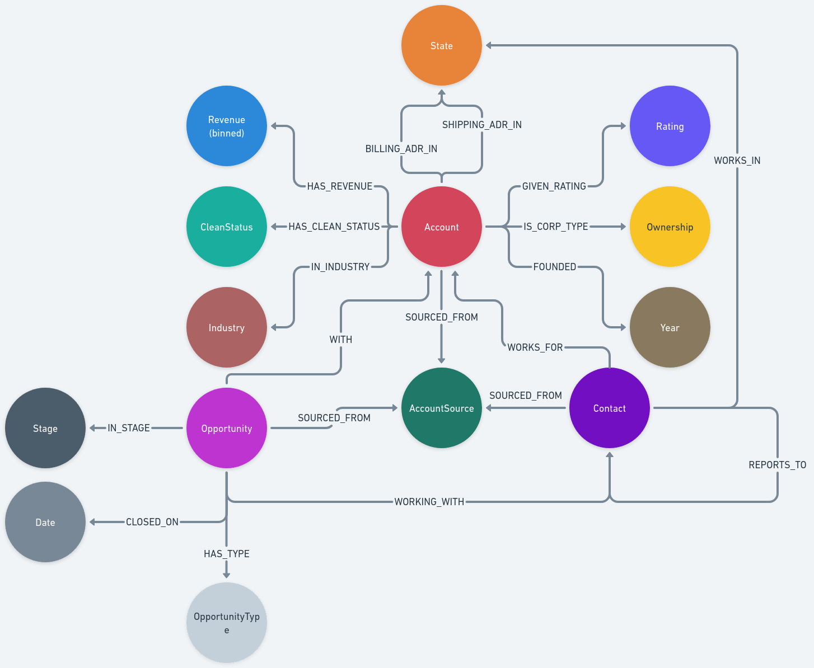

# Maca-Dash

The context for this dashboard is that it was created from the perspective of
being asked to create a tool to help a sales team at a SaaS company better
understand their clients and their own internal strengths and areas for growth.
I recommend interacting with the dashboard from that lens. The homepage of the
dashboard contains some additional information that more thoroughly describes
the components and sections you will be interacting with. Similar to an
introductory page someone might see when accessing a tool for the first time.

## Installation
The initial setup can take a while (10-20 minutes) to complete due to the creation of the Neo4j database. The data that is used is stored on public S3 buckets, so if you want to take a look at the raw csv files you should be able to download them.
### Docker
The repo can be cloned and from the project root `docker compose up` can be run which will set up and launch the service.

### Manual Install
If docker fails to work, the repo can be cloned and setup manually. It will
require you to have Neo4j 5.8.0 installed. Start neo4j with `sudo neo4j start`
and run the `./setup/setup-neo4j.sh` script to prepare the database. Then you
will want to create a python enviornment, activate it, and run `pip install -r requirements.txt`. Finally, you can run jupyter and look at the notebooks in the `./models/training/` directory or run `streamlit run ./app/Home.py` to launch the dashboard.

## Data
### SalesForce Data
I used a tool called Snowfakery to create the synthetic data that this project is built on. The repo for the data generation can be found at `https://github.com/DaltonSchutte/data-gen`. It isn't necessary to run this unless you are curious exactly how the data was generated. The extent of my involvement was collecting everything into a repo and selecting the template that was used. Everything else is handled by Snowfakery.

### 10-K Filings
The filings were scraped using `sec-edgar-downloader` and Item 7 was parsed to
use for inference. A BERT model that was specially trained on SEC documents was
fine-tuned for the sentiment analysis task. The fine-tuning was done using a
subset of a dataset of 10-K filings from 1993-2020.

### Subscription Data
This dataset was from a previous screening project I completed for a company
that offered a SaaS package. That project contained additional data and user
reviews that I did not feel comfortable including in this project. The mdoeling
and analysis was done specially for this project, though does follow a format I
typically use for straight-forward predictive modeling tasks that don't require
deep learning.

## Use
Once setup finishes, a browser window should open with a dashboard for you to explore! No additional work is necessary. There will be notebooks that walk through the model training process if you are curious about my approach to that.

## Notes
- There are some accounts that will error out when selected in the Account
  View. These are due to my sampling of the Opportunity.csv file from 50,000
  alerts, where every account had at least one opportunity, to 20,000 so the
  `setup-neo4j.sh` script would run in a reasonable amount of time. In a
  production setting, there would of course be code to handle this edge case.
  Likely, an account may not even exist to be queried if there is no
  opportunity associated with it.

- In order to give a little additional realism to the experience, I randomly
  assigned companies from the S&P500 to the first 100 accounts. As such,
  none of the analysis for any of those accounts is reflective of the actual
  conditions for any of those companies.

- The synthetic data that was used to create the SalesForce dataset is somewhat
  predictable in ways. The structures for the account subgraphs from account to
  account are not particularly varied. There also isn't a good matchup between
  states and countries (i.e. the billing address may be 123 Main Orlando
  Montana Spain 87615). This limited the analysis that could be done that would
  be useful and not just illustriative of making more plotly charts.

## Decisions and Rationale
### 1) Graph Database
I chose to use Neo4j for a couple reasons. One being that visualizing data in terms of relationships between entities can be powerful and allows an individual to use their natural pattern recognition abilities with their expertise to see trends and relationships that would be considerably more difficult to notice in tabular data. Another being that, from a modeling and analytics perspective, relational data can be incredibly powerful and result in improved performance over models that just ingest rows of data. The main reason, however, is curiosity. I was curious to connect a dashboard to a graph database backend, as I've never done something quite like this before and certainly not using a graph database to power it. I am also curious to hear how you as folks with more experience with SalesForce and the problem Maca is trying to solve respond to the analytics contained in the dashboard and, generally, how the idea of using a graph for this problem sits with you.

Below is the graph data model. Normally, this would be something we would iterate on together with a laundry list of usecases and tests to be sure the model is satisfying all of the requirements. However, given the time constraints, I did a couple short iterations of my own trying to envision what the end user would want to see.

### 2) The ML Models
I chose the models to try and demonstrate a mix of very regimented, experiment
driven development of predictive models and implementation of more
sophisticated LLMs for more complex tasks. While I had some issues with the
BERT-based Financial Sentiment model, I didn't want to spend too much time on
it to the detriment of other areas. And, if need be, I can point to
peer-reviewd papers I have published with more well-trained LLM models that I developed.

I had planned to also include a graph neural network, or at least a graph embedding model, to really leverage the power of the graph database supporting the entire application. However, I prioritized tests, documentation, and other aspects that I felt would be a better learning experience for me (namely everything around the UI) rather than produce a third ML model.

### 3) Streamlit
Admitedly, I have very little experience with front-end development. I can use
d3.js and can trudge through writing HTML, CSS, and javascript files, but it is
not my strong suit (though I would love to get better at it!) Streamlit was
something a colleague had introduced me to in passing and this seemed like a
good opportunity to give it a go. My rationale for this was because it looked
nice and was very simple to implement while still forcing me to think about UX
in ways I don't usually have to.

### 4) Visualizations
The visualizations and analyses that I chose were based on what, in my
experience, folks with a background other than statistics or analytics tend to
have an easier time understanding intuitively. To that end, distributions are
very powerful tools as are graphs. I used plotly because it is interactive and
I believe that giving folks intuitive presentations of data with the means to
explore it on their own helps them get what they need from it better than me
trying to tell them what they need.

### 5) Areas for Improvement
The integration tests with neo4j are completely lacking and the other tests in
general are not the most thorough. Improving those would go a long way to
making the code base for extending this dashboard a lot easier and more
streamlined. Some of the functions need to be refactored and split out into
multiple functions. A number of them would also probably benefit from some
abstraction. There are likely some areas where a more OOP approach would
benefit the overall service.

There are also some places where more choices for visualization would be nice.
Like allowing the user to pick combinations of variables to compare against
each other and the such.

### 6) Reflection
Overall, this project was a lot of fun! I enjoyed myself a lot and learned a
few things along the way that will be useful in my career. It helped me realize
some areas where I could stand to improve my skills and refine others. In
total, I spent somehwere between 20 and 25 hours on this.

Thank you for the opportunity to work on this and I hope to discuss it with
you!
